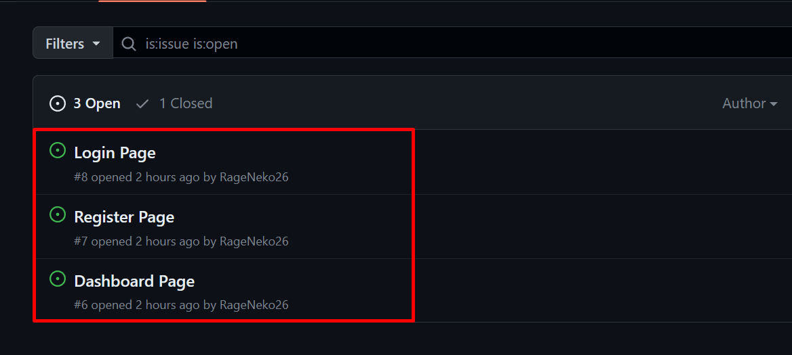

## Testing Workflow
Hanya sample file.

## Getting Started
Di sini, kita akan belajar cara kerja atau workflow tim.
Di repository sample ini kita anggap sebuah project frontend.

Sebelum memulai, terdapat 2 branch pada repository ini, yaitu <b>main</b> dan <b>staging</b>.
Branch <b>main</b> digunakan untuk <b>production</b> sedangkan branch <b>staging</b> digunakan untuk <i>staging</i> yang akan dicek oleh QA. 

Perlu diperhatikan, untuk melihat Task List atau Todo List, kalian bisa masuk di tab <b>Issue</b>.

Pada gambar di atas terdapat 3 <b>Issue</b> dengan status <b>Open</b> dan 1 <b>Issue</b> dengan status <b>Closed</b>. Artinya, terdapat 3 Task List yang tersedia untuk dikerjakan dan 1 Task List yang sudah <b>selesai</b>.

