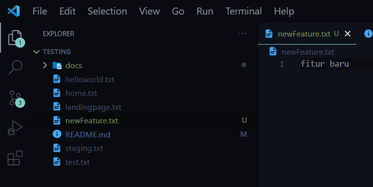

## Testing Workflow

Hanya sample file.

## Langkah-langkah

Di sini, kita akan belajar cara kerja atau workflow tim.
Di repository sample ini kita anggap sebuah project frontend.

Sebelum memulai, terdapat 2 branch pada repository ini, yaitu <b>main</b> dan <b>staging</b>.
Branch <b>main</b> digunakan untuk <b>production</b> sedangkan branch <b>staging</b> digunakan untuk <i>staging</i> yang akan dicek oleh QA.

Perlu diperhatikan, untuk melihat Task List atau Todo List, kalian bisa masuk di tab <b>Issue</b>.

Pada gambar di atas terdapat 3 <b>Issue</b> dengan status <b>Open</b> dan 1 <b>Issue</b> dengan status <b>Closed</b>. Artinya, terdapat 3 Task List yang tersedia untuk dikerjakan dan 1 Task List yang sudah <b>selesai</b>.

Setelah kita memutuskan untuk memilih Task List mana yang akan dikerjakan. Silahkan fork repository ini.

Jika Sudah kita fork selanjutnya clone repository fork tadi.

Setelah itu kita tambahkan beberapa perubahan atau penambahan feature

Jika Feature atau Perbaikan telah kita anggap selesai maka selanjutnya kita akan buat branch dengan nama feat/(feature yang anda buat).

Setelah sudah pastikan kamu di branch barunya jika belum bisa gunakan <b>git checkout (nama branch)</b>
setelah itu push seperti biasanya.

